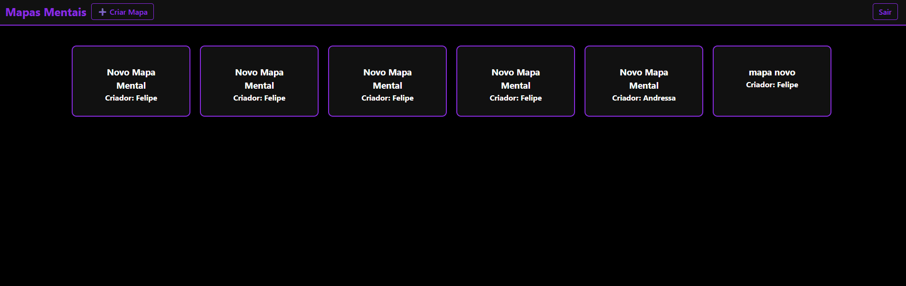

# Projeto: Aplicação web com persistência de dados do lado do servidor

Acesso: Substitua este texto pela URL de deploy do projeto

### Desenvolvedora
Andressa Teixeira | Sistemas para Internet

### Nosso produto

Site para desenvolvimento e compartilhamento de mapas mentais.
Os usuários podem criar mapas mentais personalizados com blocos de texto conectados, nomear seus mapas e armazenar suas ideias visualmente. O sistema permite que os mapas sejam persistidos no banco de dados, vinculados ao usuário que os criou, possibilitando consulta, edição e exclusão futura.

### Desenvolvimento

Durante o desenvolvimento, optei por usar o React Flow para construir a interface interativa de mapas mentais, pela sua praticidade na criação de diagramas e fluxogramas. O backend foi implementado com Node.js e Express, com persistência dos dados em MongoDB Atlas.
Foi utilizado controle de autenticação via token JWT, permitindo acesso seguro e exclusivo aos dados do usuário. Tentei implementar  no frontend, uma verificação para impedir que usuários editem mapas criados por outros, garantindo a integridade dos dados. Como todos os mapas são públicos todo mundo pode alterar, mas quando eu quiser alterar o mapa de outro usuário é criado um novo mapa para mim com aqueles dados + a minha alteração.

A aplicação foi dividida em três grandes etapas:

Criação e configuração do backend com rotas protegidas, conexão ao banco e modelo de dados.

Construção da interface do usuário usando React e integração com React Flow.

Integração entre frontend e backend com autenticação e persistência dos dados.

#### Tecnologias

Substitua este trecho por uma lista detalhada de tecnologias usadas (tanto as básicas, como HTML e CSS, como as mais específicas, por exemplo algum framework, biblioteca, etc.):
- HTML/CSS
- JavaScript (ES6)
- React
- React Flow
- Node.js
- Express.js
- MongoDB Atlas
- Mongoose
- JWT (JSON Web Tokens)
- React Router Dom
- Axios

#### Ambiente de desenvolvimento

- VS Code
- Postman
- GoLive

#### Referências e créditos
- ...
- ...

---
Projeto entregue para a disciplina de [Desenvolvimento de Software para a Web](http://github.com/andreainfufsm/elc1090-2025a) em 2025a